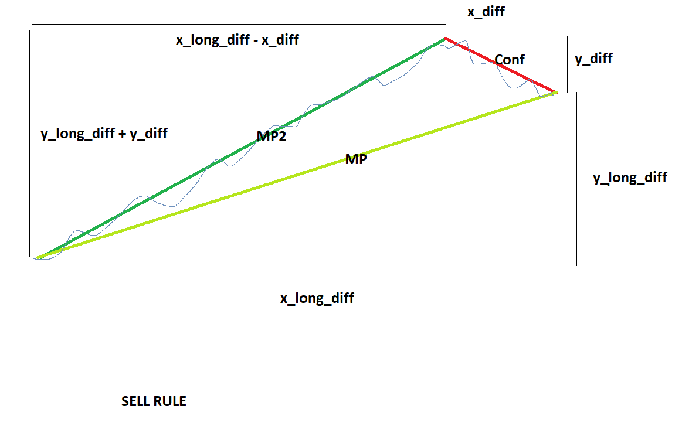
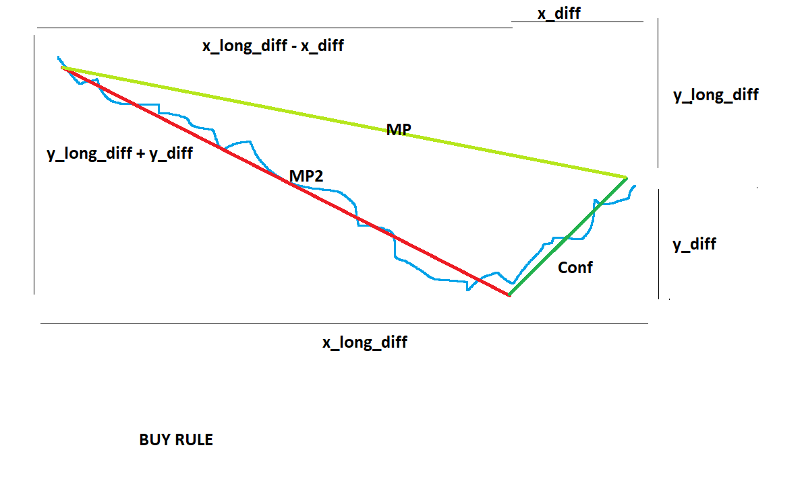
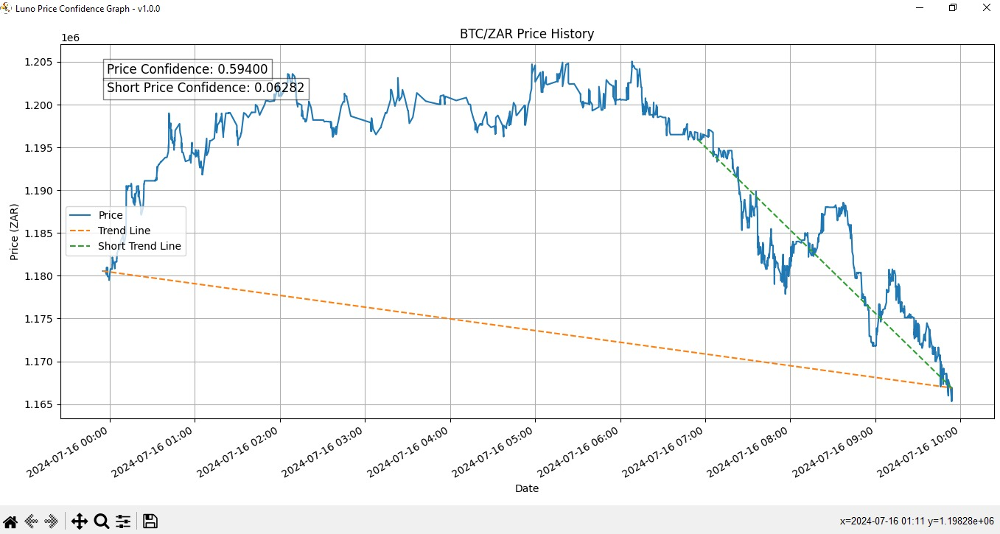
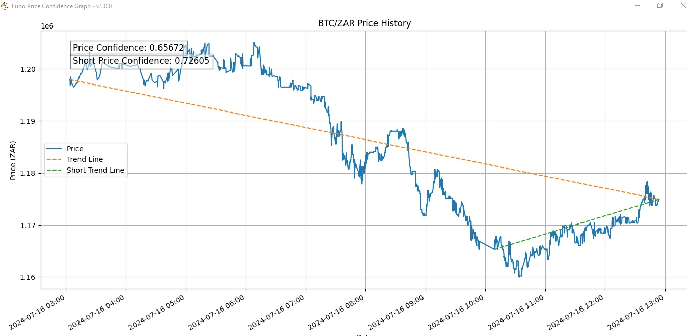
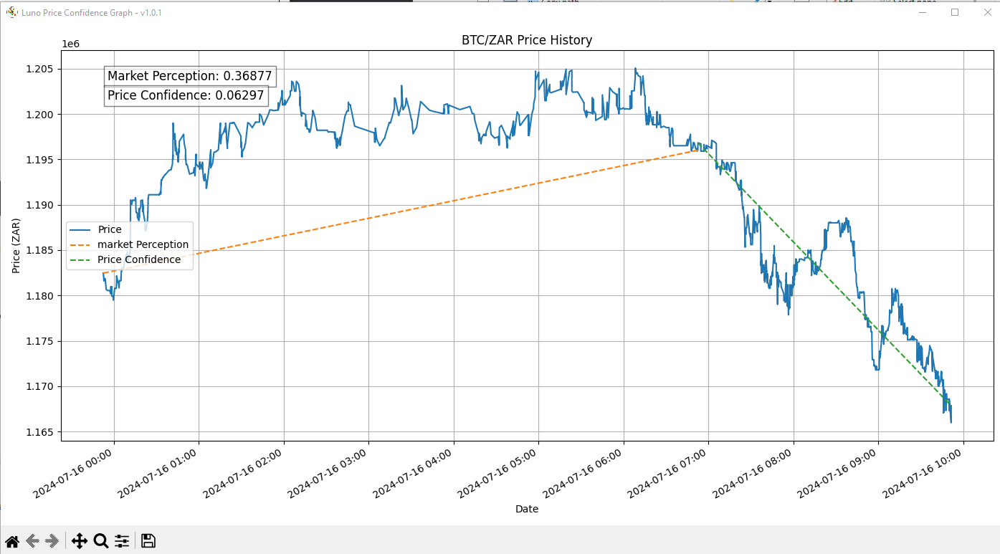
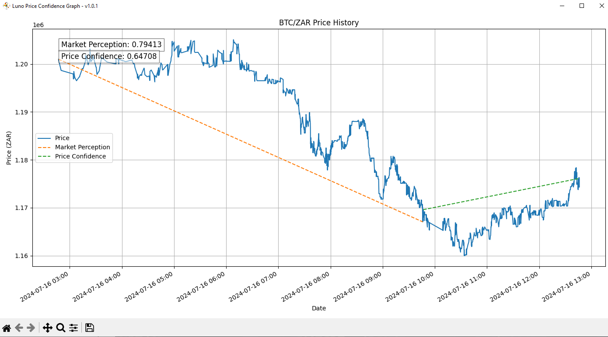

# Market Perception Formula Update

We're excited to announce an improvement to our Market Perception formula! The new version now incorporates both short-term and long-term market differences, providing a more comprehensive analysis. Let's dive into the details of this update.

## Overview

The updated formula enhances our ability to assess market perception by considering both immediate and extended market trends. This change allows for a more nuanced and accurate representation of market dynamics.

## The Formulas

### Confidence Formula
```
Confidence = f(x_diff, y_diff) = 1 - (1 / (1 + e^(-(y_diff / x_diff))))
```

### Old Market Perception Formula
```
Old Market Perception = f(x_long_diff, y_long_diff) = 1 / (1 + e^(-(y_diff / x_diff)))
```

### New Market Perception Formula
```
New Market Perception = f(x_diff, y_diff, x_long_diff, y_long_diff) = 1 / (1 + e^(-((y_long_diff + y_diff) / (x_long_diff - x_diff))))
```

## Visual Representations

To better understand the impact of this update, we've prepared some visual aids:

1. **Mathematical Graph**: This graph illustrates the mathematical concepts behind our formulas.

   **Sell Rule**
   
   
   **Buy Rule**
   

2. **Old Market Perception**: A visualization of how the previous formula assessed market perception.

   **Sell Rule**
   

   **Buy Rule**
   

3. **New Market Perception**: This graph showcases the improved analysis provided by our updated formula.

   **Sell Rule**
   

   **Buy Rule**
   

## Benefits of the New Formula

1. **Comprehensive Analysis**: By incorporating both short-term and long-term market differences, we achieve a more holistic view of market trends.
2. **Improved Accuracy**: The new formula provides a more precise representation of market perception, leading to better-informed decisions.
3. **Enhanced Trend Identification**: With the inclusion of multiple timeframes, it's easier to identify and analyze both immediate market reactions and longer-term sentiment shifts.

## Next Steps

We recommend checking the latest version's logic with the Luno Price Confidence Graph to see the improved formula in action. This will help you understand how the new market perception calculations translate into real-world market analysis.

# Configuration Update

We've updated our `config.bat` file to provide a more interactive and user-friendly way of configuring the bot. This new batch file allows for quick and easy adjustments to various settings, enhancing the flexibility and customization options for our bot.

### How the New config.bat Works

1. The batch file starts by setting default values for key parameters:
   - Trading pair (PAIR)
   - Market Perception Threshold value (THRESHOLD)
   - Confidence threshold value (SHORT_THRESHOLD)
   - API call delay (API_CALL_DELAY)
   - Period value (PERIOD)
   - Short period value (SHORT_PERIOD)
   - Depth chart range (RANGE)

2. It then prompts the user to input new values for each parameter. If the user presses Enter without typing a value, the default value is used.

3. After collecting all inputs, the script generates a `config.py` file with the updated values.