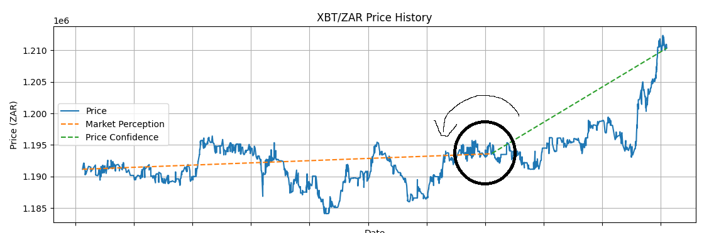

# Luno Trader Update Notes - Version 1.0.2

## What's New?

We've introduced a new way to measure market trends called the Market Momentum Indicator (MMI). This new tool combines our existing measures to give us a clearer picture of what's happening in the market.

### Market Momentum Indicator (MMI)
- MMI is a new metric that combines our two existing indicators:
  - Market Perception (MP): Our view of the overall market trend
  - Price Confidence (PC): Our assessment of short-term price movements
- We calculate MMI like this: MMI = (MP + PC) / 2

### Better Graphs
- Our Price Confidence Graph now shows the new MMI
- The Trader Confidence Graph also displays MMI alongside our other metrics

### Smarter Trading Rules
We've updated our buying and selling rules to use this new MMI. But before we get into the new rules, let's review how the old system worked.

## Understanding the Old Trading Rules

Our system used two main indicators to make decisions:

1. Market Perception (MP)
2. Price Confidence (PC)

Both of these were measured on a scale from 0 to 1, where 0.5 is neutral.

### Old Buy Rule

The system would recommend buying when ALL of these conditions were met:

1. Market Perception was high enough (above 0.5 plus a set amount)
2. Price Confidence was high enough (above 0.5 plus a set amount)
3. You had enough South African Rand (ZAR) to make the purchase

### Old Sell Rule

The system would recommend selling when ALL of these conditions were met:

1. Market Perception was low enough (below 0.5 minus a set amount)
2. Price Confidence was low enough (below 0.5 minus a set amount)
3. You had enough cryptocurrency to sell

If none of these conditions were fully met, the system recommended doing nothing.

## New Trading Rules

We've updated our trading rules to incorporate the new Market Momentum Indicator (MMI) and provide more flexibility. Here's how the new system works:

### New Buy Rule
The system will recommend buying when EITHER of these sets of conditions are met:

1. Set A:
   - Market Perception (MP) is high enough (above 0.5 plus the MARKET_PERCEPTION_THRESHOLD)
   - Price Confidence (PC) is high enough (above 0.5 plus the PRICE_CONFIDENCE_THRESHOLD)
   - You have enough South African Rand (ZAR) to make the purchase (at least 0.0001 BTC worth)

   OR

2. Set B:
   - Price Confidence (PC) is high enough (above 0.5 plus the PRICE_CONFIDENCE_THRESHOLD)
   - Market Momentum Indicator (MMI) is high enough (above 0.5 plus the MARKET_MOMENTUM_INDICATOR_THRESHOLD)
   - You have enough South African Rand (ZAR) to make the purchase (at least 0.0001 BTC worth)

### New Sell Rule
Similarly, the system will recommend selling when EITHER of these sets of conditions are met:

1. Set A:
   - Market Perception (MP) is low enough (below 0.5 minus the MARKET_PERCEPTION_THRESHOLD)
   - Price Confidence (PC) is low enough (below 0.5 minus the PRICE_CONFIDENCE_THRESHOLD)
   - You have enough cryptocurrency to sell (at least 0.0001 BTC)

   OR

2. Set B:
   - Price Confidence (PC) is low enough (below 0.5 minus the PRICE_CONFIDENCE_THRESHOLD)
   - Market Momentum Indicator (MMI) is low enough (below 0.5 minus the MARKET_MOMENTUM_INDICATOR_THRESHOLD)
   - You have enough cryptocurrency to sell (at least 0.0001 BTC)

If none of these conditions are fully met, the system recommends doing nothing - neither buying nor selling.

This new approach provides more flexibility in our trading decisions. It allows us to act on strong signals from either our long-term (Market Perception) or short-term (Price Confidence) indicators, while also considering the overall Market Momentum Indicator. The inclusion of the minimum trade amount (0.0001 BTC) ensures that we're not making impractically small trades. This should help us catch more potential trading opportunities while still maintaining a balanced approach to risk.

### Calculation of MMI
It's important to note that the Market Momentum Indicator (MMI) is calculated as the average of Market Perception and Price Confidence:

```
MMI = (Market Perception + Price Confidence) / 2
```

This means that MMI provides a balanced view of both long-term and short-term market trends, which is used in our decision-making process.
## Understanding the Positive MMI Angle

We've introduced a new visual representation to help understand when the Market Momentum Indicator (MMI) is positive. This is illustrated in the following image:



### The MMI Angle
- The MMI is considered positive when it's above 0.5
- We represent this visually as an angle in a 2D space
- The angle is formed by the Market Perception (MP) and Price Confidence (PC) values

## Configuration Changes

We've renamed some of our configuration settings to make them clearer:

- `SHORT_THRESHOLD` is now called `PRICE_CONFIDENCE_THRESHOLD`
- `THRESHOLD` is now called `MARKET_PERCEPTION_THRESHOLD`
- We've added a new setting: `MARKET_MOMENTUM_INDICATOR_THRESHOLD`

These new names should make it easier to understand what each setting does. You can adjust these thresholds to fine-tune the system's sensitivity to different market conditions.

## Other Improvements
- Our graphs now adjust better to show all the data
- We've made the layout of our graphs clearer and easier to read
- The zoom feature on our graphs works better now

## Technical Stuff (for the curious)
- We've cleaned up our code to make it run faster and be easier to update in the future
- We've fixed some bugs that were causing issues with our graphs and data

---

This update aims to make our trading system smarter and easier to understand. By introducing the Market Momentum Indicator, we're combining our different market views into one clear signal, which should help make better trading decisions. The new trading rules provide more flexibility, allowing the system to respond to various market conditions more effectively. The renaming of our configuration settings should also make it easier to adjust the system to your needs.